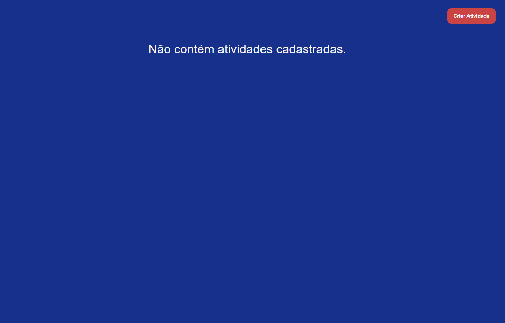
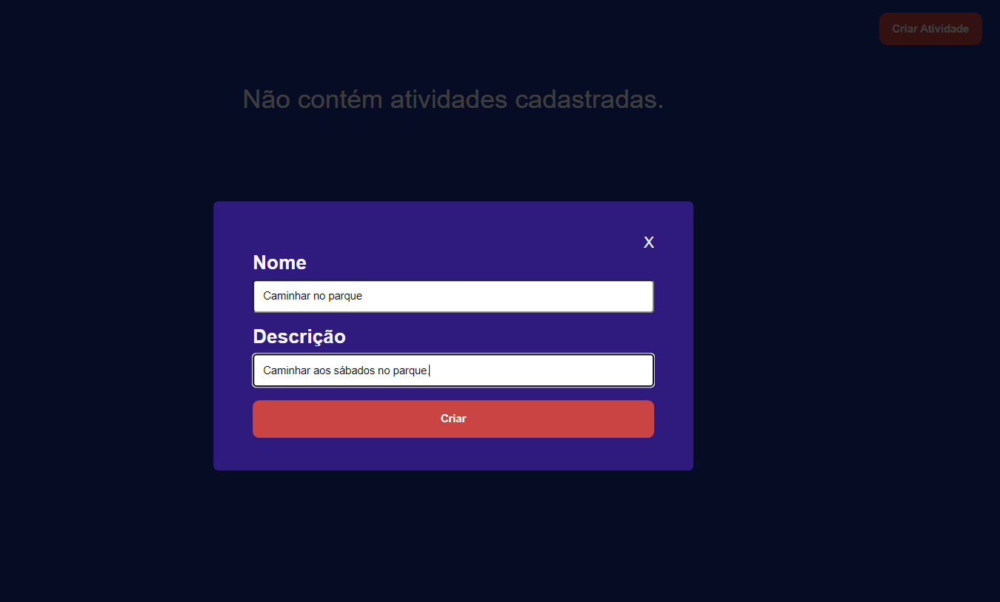

# APP

Desafio para Desenvolvedor Full-Stack Web. Foi desenvolvida uma API RESTful utilizando Node, Docker e NestJs para gerenciamento de atividades, oferecendo operações essenciais para manipulação dos dados:

Adicionar Atividade: Permite adicionar uma nova atividade através da rota POST /activity.

Editar Atividade: Permite atualizar as informações de uma atividade específica através da rota PUT /activity/:id.

Deletar Atividade: Permite remover uma atividade específica da base de dados através da rota DELETE /activity/:id.

Visualizar uma Atividade: Permite obter os detalhes de uma atividade específica através da rota GET /activity/:id.

Visualizar Todas as Atividades: Permite listar todas as atividades cadastradas através da rota GET /activity.

No front-end, foi implementada uma aplicação utilizando React, Typescript e React Query, consumindo os endpoints fornecidos pela API para realizar operações de adição, edição, exclusão, e visualização de uma única atividade e de todas as atividades disponíveis.

### Clonando o repositório

```sh
gh repo clone GuiOrlandin/desafioAlvadorn
```

### Navegue até os diretórios do projeto

```sh
cd api
```

```sh
cd web
```

## Back-end (API)

### Instale as dependências

```sh
npm i
```

### Execute o docker compose

```sh
docker compose up
```

### Execute o docker e rode as migrations

```sh
docker start
```

```sh
npx prisma migrate dev

```

### Inicie a aplicação no back-end

```sh
npm run start:dev
```

### Rode os testes da aplicação

```sh
npm run test
```

## Front-end (WEB)

### Instale as dependências

```sh
npm i
```

### Inicie a aplicação

```sh
npm run dev
```

## Demo

Tela principal sem nenhuma atividade listado.

Processo de criar uma atividade.

Página principal com todos as atividades sendo exibidas

Página mostrando as características de uma atividade específica.

Processo de atualização de uma atividade, em que os dados anteriores são exibidos nos inputes ao entrar na página.

Dialog que é aberto quando solicita-se a exclusão de uma atividade.

